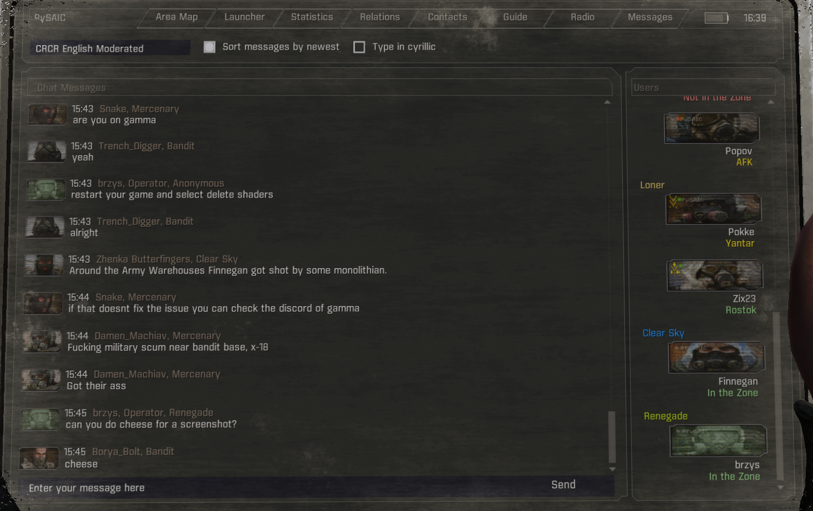

# Python Stalker Anomaly IRC Client
or PySAIC for short.  
Based on [CRCR / Chernobyl Relay Chat Rebirth](https://github.com/8r2y5/Chernobyl-Relay-Chat-Rebirth), rewritten in Python with additional features and improvements.  
Compatible with any Stalker Anomaly version and modpack that uses Stalker Anomaly.



## Stable
<a href="https://github.com/8r2y5/PySAIC/releases/latest"></a>

  
## Beta
<a href="https://github.com/8r2y5/PySAIC/releases/0.3.0b14"></a>


# Features
- **Works both in your PDA or as separate overlay**
  - You can choose your prefered version during installation.
- **Works with any version of Stalker Anomaly and modpack that uses it**
- **Patches for:**
  - [Fatal Error](https://www.moddb.com/addons/fatal-error-by-ncenka)
  - [iTheon-PDA-Taskboard](https://github.com/lTheon/iTheon-PDA-Taskboard)
  - [Mod App Creator](https://github.com/Ncenka/Mod-App-Creator)
  - [MAGS Redux](https://github.com/RAX-Anomaly/MagsRedux)
- **Ability to connect to different IRC servers**
  - Want to use your own server? You can do that! Just edit the `server.yml` file.
  - You can connect to any IRC server that supports the protocol, not only the one that Chernobyl Relay Chat uses. Just change it in `server.yml` file.
  - Twitch IRC is supported too, you can use it to chat with your viewers while streaming Stalker Anomaly.
    - Check [Twitch Connection Guide here](#Twitch-Connection-Guide).  
- **Custom channels / Networks**
  - Want to create your own channel? Perhaps even use different network for your community? You can do that! Just add it or modify the `server.yml` file.
- **Customizable**
  - Change your nickname, avatar, color theme, font and other settings in the options menu.
- **Block Users**
  - Block users from sending you messages or interacting with you in-game.
- **Block Words**
  - Block messages that contain specific words or phrases.
- **Private Messaging**
  - Send private messages to other players in-game.
- **Money Transfer**
  - Send money to other players in-game.
- **Command Support**
  - Supports various commands for managing your chat experience.
- **Easy Installation**
  - Simple installation process, just use Mod Organizer 2 or extract the files and run the client.
- **Cross-Platform**
  - Works on Windows or Linux.
- **Supports for [New Levels](https://www.moddb.com/mods/stalker-anomaly/addons/promzone-level)**
  - Compatible with Grimwood, Promazone, and Town Yuzhniy.
- **Custom Avatars / Profile Picture**
  - You can create your own avatar using PySAIC avatar creator, please note it will be only visible to you.
- **See others status in-game - Compatible with [CRCR / Chernobyl Relay Chat Rebirth](https://github.com/8r2y5/Chernobyl-Relay-Chat-Rebirth)**
  - Online status 
  - Avatar / Profile Picture
  - Faction
  - **PySAIC Client** (if they use it)
    - Location name
    - AFK status
    - Rank
    - Reputation
    - Status (Underground / Emission)
- **Simulation of signal reception in-game**
  - You can configure what PySAIC should do when you are under emission or underground (you can set it up separately in options):
    - **Random** (_default_)
      - each time you go under emission or underground PySAIC will choose what do
    - **Never**
      - PySAIC will stay always connected no matter what
    - **Malform Signal Only**
      - PySAIC will malform messages coming in and out, example:
        - `forgot i haven't done scorcher in this run and got a guide to jupiter lmao`
        - `fORgOt i haven't done scIrche' in.th*s rhn]4nD g8t - gqid/ to juPite! lmAo`
    - **Always**
      - PySAIC will malform messages comming in and out for 10 seconds before disconnecting and connect when network will be avaliable


## Ability to identify with IRC server
You can provide password in `Options`.  
To register your nick type, `/msg NickServ REGISTER [password] [email]` and follow the instructions.
Configuration is stored in `config.yml` file, which is created after the first run of the client.

## Commands
You can find all available commands in-game by typing `/commands` or `/help`.
All commands that requires to provide nick can be used with `@` for nick completion.

| Command      | Description                                     | Usage                            | Note                                                                                                                             |
|--------------|-------------------------------------------------|----------------------------------|----------------------------------------------------------------------------------------------------------------------------------|
| `/block`     | Blocks interactions/messages with provided user | Check `/block` command section   |                                                                                                                                  |
| `/blockword` | Blocks messages that contain specified word     | See `/blockword` command section |                                                                                                                                  |
| `/help`      | Shows help message for command                  | `/help block`                    |                                                                                                                                  |
| `/commands`  | Shows avaliable commands                        | `/commands`                      |                                                                                                                                  |
| `/msg`       | Sends private message to user                   | `/msg [nick] [message]`          |                                                                                                                                  |
| `/m`         | Alias for `/msg`                                | `/m [nick] [message]`            |                                                                                                                                  |
| `/w`         | Alias for `/msg`                                | `/w [nick] [message]`            |                                                                                                                                  |
| `/priv`      | Alias for `/msg`                                | `/priv [nick] [message]`         |                                                                                                                                  |
| `/dm`        | Alias for `/msg`                                | `/dm [nick] [message]`           |                                                                                                                                  |
| `/nick`      | Changes you nicname in chat.                    | `/nick [new nick]`               | Nick cannot contain space, it's IRC limitation                                                                                   |
| `/reply`     | Replyes to last private message/dm              | `/reply [message]`               |                                                                                                                                  |
| `/r`         | Alias for `/reply`                              | `/r [message]`                   |                                                                                                                                  |
| `/pay`       | Transfers money to another user                 | `/pay [nick] [amount]`           | Both need to be in-game. There is option to block money transfer in `Options`. Accepts human friendly values `/pay user 1.5k`.   |
| `/exit`      | Closes the client                               | `/exit`                          |                                                                                                                                  |
| `/afk`       | Sets you as AFK                                 | `/afk`                           | Will show AFK status in chat, other players can see it.                                                                          |
| `/mode`      | Sends IRC MODE command                          | `/mode [mode]`                   | [See IRC MODE](https://matrix-org.github.io/matrix-appservice-irc/latest/irc_modes.html)                                                                                                              |
| `/who`       | Sends IRC WHO command                           | `/who [nick/channel]`            |                                                                                                                                  |


# /block command usage
It is stored inside `comfig.yml` file.

| Command       | Description         | Usage                |
|---------------|---------------------|----------------------|
| `/block list` | Lists blocked users | `/block list`        |
| `/block add`  | Blocks user         | `/block add [nick]`  |
| `/block del`  | Removes user        | `/block del [nick]`  |

# /blockword command usage
It is stored inside `config.yml` file.

| Command           | Description                   | Usage                   |
|-------------------|-------------------------------|-------------------------|
| `/blockword list` | Lists blocked words           | `/blockword list`       |
| `/blockword add`  | Blocks messages with word     | `/blockword add [word]` |
| `/blockword del`  | Removes word from block list  | `/blockword del [word]` |

# Discord Server
<div>
    <p>
        <a href="https://discord.gg/9ef8NKjEjg">
            
        </a>
    </p>
</div> 

# Installation 
Use mod manager or for those who are not using it, here are steps how to install it directly into Anomaly
1. Extract the contents of the zip wherever you like, preferably inside Anomaly's game directory.
2. Copy the included in `00_Core` folder (`bin`, `gamedata`, `res`, `pysaic`) folders to your Anomaly directory.
    - `bin` -> `Anomaly\bin`
    - `gamedata` -> `Anomaly\gamedata`
    - `res` -> `Anomaly\res`
    - `pysaic` -> `Anomaly\pysaic`

# Usage
Run `pysaic.exe`; the application must be running for in-game chat to work.  
After connecting, click the Options button to change your name and other settings, it can be lunched after/before Anomaly.  
Once playing, press Enter (by default) to bring up the chat interface and Enter again to send your message, or Escape to close without sending.  
You may use text commands from the game or client by starting with a /. Use `/commands` to see all available commands.

# Connecting to different IRC servers
You can connect to any IRC server that supports the protocol.
PySAIC upon starting (or missing) creates `server.yml` file in the same directory as `pysaic.exe`.
You can edit this file to change the server, port, and other connection settings. You can also add/remove/modify channels too.
You can share this file with other players to connect to the same server and channels.

## **Twitch Connection Guide**

⚠️ **Note:** Integration with Twitch IRC is not fully supported, and some PySAIC features may not work as expected.

This guide will walk you through the process of connecting your application to Twitch's IRC servers.

### **Example Configuration**

First, here's a complete example of the `server.yml` file for a Twitch connection. You will modify this file with your own account details.

```yaml
server: 'irc.chat.twitch.tv'
port: 6667
nick: 'your_twitch_username'
password: 'oauth:your_oauth_token'
channels:
  - description: 'Your Channel'
    name: '#your_twitch_username'
commands:
  - "CAP REQ :twitch.tv/membership twitch.tv/tags twitch.tv/commands"
```

-----

### **Steps to Connect**

1.  **Create a Twitch Account:** If you don't already have one, create a free Twitch account.
2.  **Generate an OAuth Token:** Go to [Twitch Token Generator](https://twitchtokengenerator.com/) to generate a password for your account. This is a special OAuth token that is required for IRC connections.
3.  **Configure `server.yml`:** Open the `server.yml` file and update the following settings:
      * `server`: Set to `irc.chat.twitch.tv`
      * `port`: Set to `6667`
      * `nick`: Set to your **Twitch username** (all lowercase)
      * `password`: Set to the **OAuth token** you generated. Be sure to include the `oauth:` prefix.
      * `channels`: Set to the channels you want to join. A channel name must be prefixed with a `#`, for example, `#your_twitch_username`.
4.  **Request IRC Capabilities:** To receive additional information like user badges and message metadata, add the following line to the `commands` section in your `server.yml` file.
    ```
    commands:
      - "CAP REQ :twitch.tv/membership twitch.tv/tags twitch.tv/commands"
    ```

      * `twitch.tv/membership`: Allows you to see user joins and parts.
      * `twitch.tv/tags`: Provides message metadata like user badges, color, and `display-name`.
      * `twitch.tv/commands`: Enables you to receive information about host, raid, and other commands.
5.  **Restart PySAIC:** Save the `server.yml` file and restart your application. You should now be connected to Twitch IRC and ready to chat.

# Custom Avatar / Profile Picture
In options, you can set your own avatar, uploading/creating new one will require restarting the game.
Custom avatars are displayed only locally, other players will see the default avatar based on your nickname and current faction.

# Custom IRC commands on connect
You can add custom IRC commands to be executed upon connecting to the server.
This can be useful for requesting additional capabilities or setting user modes.
To add custom commands, edit the `server.yml` file and add your commands under the `commands` section.
Each command should be a separate entry in the list.
By default, the following commands are included:
```yaml
commands:
  - MODE {nick} +x
```

Example:
```yaml
commands:
  - "CAP REQ :twitch.tv/membership twitch.tv/tags twitch.tv/commands"
  - "MODE {nick} +B"
```

# Font
Thanks to [JetBrains](https://www.jetbrains.com/lp/mono) for the great font!

# What changed?
See [CHANGELOG.md](CHANGELOG.md) for details.