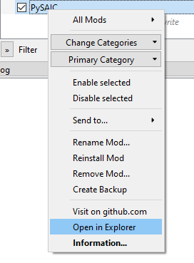
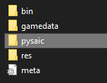
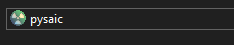
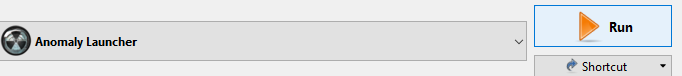

# Note
In order for chat to work in-game PySAIC needs to be up and running.
It does not matter if you start it after or before your game.

# Steps
## 1. Open mod via mod manager

## 2. Open pysaic folder

## 3. Launch pysaic.exe
You can create shortcut to this file on your desktop for easier usage.
This way you won't need to do those steps each time.

## 4. Launch your game

